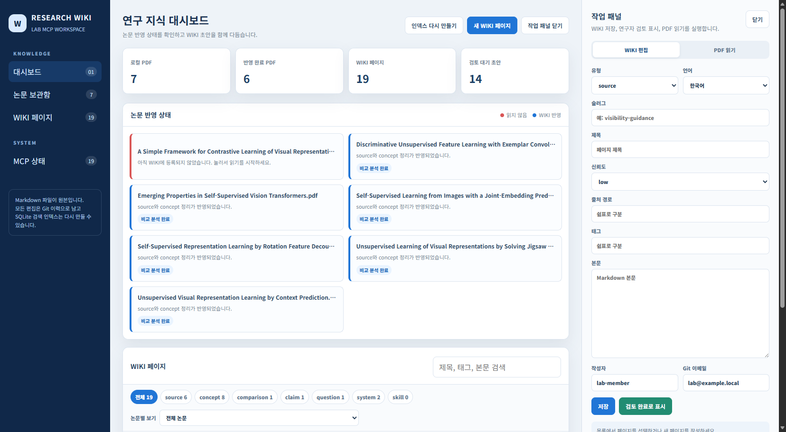

# Research WIKI — 나만의 LLM Wiki를 만드는 MCP 도구

자기 자료(PDF)를 넣으면, AI 에이전트(Claude Code / Codex)가 MCP로 그것을 읽고 정리해 **Git으로 관리되는 Markdown 위키 + 로컬 뷰어 GUI**를 만들어 주는 단일 실행형 제품입니다. clone 후 바로 쓸 수 있는 예시 위키(`wiki/`)가 이미 들어 있고, 자기 자료를 넣어 자기만의 위키로 키울 수도 있습니다.



> 위 화면은 이 도구로 운영 중인 실제 지식베이스가 렌더링된 모습입니다. 더 보기: [demo/](demo/README.md)

---

## 🚀 30분 빠른 시작 — clone → 첫 위키 페이지 → 화면 확인

처음 보는 사람이 자기 자료 1건으로 첫 위키 페이지를 만들고 화면에서 확인하는 전체 흐름입니다.

### 0. 사전 요구사항 (≈5분)

- **Python 3.11+** 와 **Git**
- AI 에이전트: **Claude Code** 또는 **Codex** (MCP 클라이언트). 에이전트 없이 GUI만 둘러볼 수도 있습니다.

### 1. 설치 (≈5분)

```powershell
git clone <this-repo-url> Research_WIKI
cd Research_WIKI
python -m venv .venv
.\.venv\Scripts\Activate.ps1          # macOS/Linux: source .venv/bin/activate
python -m pip install --upgrade pip
python -m pip install -e .
```

설치되는 콘솔 명령 2개: `research-wiki-mcp`(MCP 서버), `research-wiki-gui`(뷰어).

### 2. 뷰어 실행 → 기본 제공 위키 확인 (≈3분)

```powershell
research-wiki-gui --host 127.0.0.1 --port 8780 --root .
```

브라우저에서 `http://127.0.0.1:8780` 을 엽니다. 이미 반영된 예시 위키(자기지도학습 논문)가 보입니다.

> 검색 인덱스(`data/`의 SQLite)는 Git에 포함되지 않지만, 서버·뷰어가 기동할 때 `wiki/`의 Markdown으로부터 자동 재생성되므로 별도 작업이 필요 없습니다.

### 3. 자기 자료 투입 (≈2분)

자신의 PDF를 `raw/papers/` 폴더에 복사합니다. (따라하기용 샘플 `raw/papers/sample-note.pdf`도 들어 있습니다.)

```powershell
Copy-Item "C:\path\to\내자료.pdf" raw\papers\
```

### 4. 에이전트에 통합 요청 (≈10분)

이 프로젝트 폴더에서 **Claude Code**를 실행하면 프로젝트 MCP 서버(`research-wiki`)와 SessionStart 훅이 자동 적용됩니다. 그다음 자연어로 요청합니다:

```
raw/papers/sample-note.pdf 를 위키로 정리해줘
```

에이전트는 [`wiki-ingest` 스킬](.claude/skills/wiki-ingest/SKILL.md)을 따라:
PDF 읽기 → `source` 페이지 저장(draft) → 재사용 `concept` 페이지 저장 → 인덱스 갱신을 수행합니다.

> Codex 사용자는 아래 "에이전트 연결" 절을 참고해 `research-wiki` MCP를 등록한 뒤 같은 요청을 합니다.

### 5. 화면에서 확인 (≈2분)

GUI를 새로고침합니다. `논문 보관함`에서 방금 넣은 자료가 파란색(반영 완료)으로 바뀌고, `WIKI 페이지`에 새 `draft` 페이지가 나타납니다. 내용을 확인한 뒤 `검토 완료로 표시`를 누르면 `reviewed`가 됩니다. ✅ 완료.

---

## 📦 저장소 구성

| 경로 | 역할 |
| --- | --- |
| `harness/` | 에이전트 운영 컨텍스트 — [contract](harness/contract.md), [procedure](harness/procedure.md), [preference](harness/preference.md), [validation](harness/validation.md) |
| [`AGENTS.md`](AGENTS.md) · [`RULES.md`](RULES.md) | 에이전트 운영 지침과 빠른 규칙 요약 |
| `.claude/skills/wiki-ingest/` | 자료 통합 워크플로 **스킬** (에이전트가 자동 사용) |
| `.claude/settings.json` · `scripts/session_context_hook.py` | 세션 시작 시 규칙을 주입하는 **SessionStart 훅** |
| `tools/research_wiki_mcp/` | **시각화 도구** — MCP 서버 + 로컬 뷰어 GUI |
| `wiki/` | canonical Markdown 위키 (이미 사용 가능한 페이지 제공) |
| `wiki/system/page-schema.md` | 위키 페이지 **스키마** |
| `raw/papers/` | 자기 PDF 투입 위치 (샘플 1건 동봉) |
| `data/` | 재생성 가능한 SQLite 검색 인덱스 |
| `demo/` | 실사용 렌더링 화면 캡처 |
| `specs/` | 기획·요구사항·의사결정 라운드·에이전트 SPEC |

---

## 🛠 MCP Tool 목록과 동작

`research-wiki` MCP 서버가 노출하는 기능 (GUI `MCP 상태`에서 개별 on/off 가능):

### Resources
| 이름 | 동작 |
| --- | --- |
| `wiki://index` | 검색 가능한 전체 위키 인덱스 반환 |
| `wiki://papers` | 로컬 PDF의 위키 반영 상태 반환 |
| `wiki://page/{page_type}/{slug}` | 단일 canonical 위키 페이지 반환 |

### Tools
| 이름 | 동작 |
| --- | --- |
| `pdf_extract_text` | 로컬 PDF 텍스트 추출 (페이지 범위 지원) |
| `pdf_render_screenshots` | PDF 페이지를 이미지+텍스트로 렌더 (시각 근거용) |
| `wiki_publish_pdf_screenshots` | 선택 스크린샷을 `wiki/assets/`에 게시하고 본문에 삽입 |
| `wiki_save_page` | Git 관리 Markdown 페이지 생성·수정 (AI 작성분은 draft) |
| `wiki_create_research_page` | 사용자 주도 `claim`/`question` 페이지 생성 |
| `wiki_read_page` | 단일 페이지를 구조화해 읽기 |
| `wiki_search` | canonical 위키 내용 검색 |
| `wiki_review_page` | `draft` → `reviewed` 승격 (사람 지시 시) |
| `wiki_capture_discussion` | 대화 중 재사용 가치 있는 지식을 적절한 페이지에 적재 |
| `wiki_list_revisions` / `wiki_restore_revision` | Git 리비전 조회·복원 |
| `wiki_rebuild_index` | Markdown으로부터 검색 인덱스 재생성 |
| `prepare_comparison_workflow` | 논문 간 `comparison` 작성 워크플로 준비 |

### Prompts
`paper_ingest_workflow`, `claim_refinement_workflow`, `novelty_review_workflow`

> 서버는 LLM API를 호출하지 않습니다. 요약·아이디어 추출·검토 같은 추론은 연결된 에이전트가 수행하고 결과만 MCP로 저장합니다. 에이전트의 역할·권한·허용 기능은 [specs/agent-spec.md](specs/agent-spec.md)에 정의되어 있습니다.

---

## 🔌 에이전트 연결

### Claude Code
프로젝트에 [`.mcp.json`](.mcp.json)이 포함되어 있어, 이 폴더에서 Claude Code를 실행하고 프로젝트 MCP 서버 사용을 승인하면 됩니다. 직접 등록하려면:

```powershell
claude mcp add --transport stdio --scope project research-wiki -- research-wiki-mcp --root "${CLAUDE_PROJECT_DIR:-.}"
```

### Codex
```powershell
codex mcp add research-wiki -- research-wiki-mcp --root "C:\path\to\Research_WIKI"
codex mcp list
```

토큰 보호 HTTP 전송 등 상세 연결 방법은 [docs/client-setup.md](docs/client-setup.md)를 참고하세요.

---

## ✅ 검증 방법

```powershell
python -m unittest discover -s tests -v   # 28개 테스트 (stdio/HTTP MCP e2e 포함)
python -m compileall -q tools tests
research-wiki-mcp --help
research-wiki-gui --help
```

`tests/test_e2e_workflow.py`는 실제 MCP `stdio` 연결로 PDF 추출 → `source`·`concept` 반영 → 파란 논문 상태 → 비교 배지 → 검토 완료 → 검색 → 인덱스 재생성을 검증합니다.

---

## 위키 객체 유형

| 유형 | 역할 |
| --- | --- |
| `source` | 한 논문/자료의 근거 중심 정리 |
| `concept` | 자료를 가로지르는 재사용 가능한 핵심 아이디어 |
| `comparison` | 사용자가 요청한 자료 간 비교 |
| `claim` | 사용자 입력 기반 연구 주장 |
| `question` | 사용자 입력 기반 열린 연구 질문 |
| `system` | 위키 운영 문서 |
| `skill` | 재사용 가능한 에이전트 워크플로 |

`raw/papers`의 PDF는 처음에 빨간색(미반영)입니다. 같은 PDF를 출처로 한 `source`와 `concept`가 저장되면 파란색이 되고, `comparison`까지 저장되면 비교 분석 완료 배지가 붙습니다.

## 첫 마일스톤 제외 범위

외부 서버 배포 · DOI/URL 입력 · 공유 폴더 자동 감시 · 사용자별 계정/권한 · Git 외 자동 백업 · 서버 내부 LLM API 호출.
