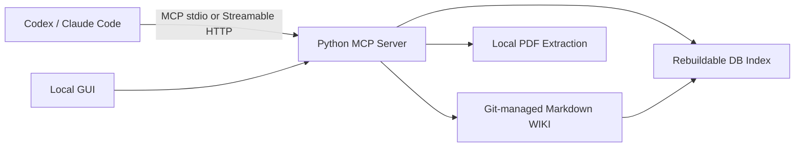

# Research MCP WIKI Tool PRD

Status: first local milestone implemented
Updated: 2026-06-01

## 1. Product Goal

Build a lab-shared research WIKI with an MCP server and local GUI. The system must help researchers and AI coding clients preserve paper knowledge, extract reusable concepts, compare related work, maintain research claims and questions, and support novelty-review workflows.

The first milestone is a locally verifiable product. It does not deploy to an external server and does not call an LLM API from the server.

## 2. Users

- Lab researchers: browse, search, edit, review, and recover shared WIKI content.
- Codex and Claude Code: use MCP resources, tools, and prompts to perform model-dependent research reasoning.
- Maintainers: run the server and GUI, configure the shared token, rebuild the index, and inspect Git history.

## 3. Product Principles

- Markdown is canonical.
- Git records history and provides recovery.
- The database is a rebuildable index, never the source of truth.
- AI-authored content starts as `draft`.
- Researchers promote confirmed content to `reviewed`.
- MCP exposes both reads and writes.
- The first server remains deterministic and does not hold LLM API credentials.

## 4. First-Milestone Architecture

## 5. Canonical WIKI Model

Supported Markdown page types:

| Type | Purpose |
| --- | --- |
| `source` | Structured paper notes with evidence anchors |
| `concept` | Reusable mechanism-level ideas across papers |
| `comparison` | Optional cross-paper synthesis |
| `claim` | User-driven research claims and prior-art risks |
| `question` | User-driven open research questions |
| `system` | WIKI operating documentation |
| `skill` | Reusable AI-agent workflow instructions |

Required metadata includes page type, title, status, updated time, confidence, sources, and tags. PDF-grounded pages record file paths and page or section anchors.

## 6. Paper Ingestion Workflow

1. User chooses a local PDF.
2. User chooses `text extraction` or `image + text screenshot` reading.
3. User chooses Korean reflection by default or explicitly requests English reflection.
4. For screenshot reading, user may choose a page range.
5. MCP server extracts deterministic PDF artifacts while preserving original text.
6. Codex or Claude Code reads the artifacts and writes `source` and `concept` reflections through MCP in the requested language.
7. The server stores Markdown changes and refreshes the derived index.
8. The GUI changes the paper state from red to blue.
9. If the user requests comparison synthesis, the client writes a `comparison` page and the GUI shows a badge.

`claim` and `question` pages are separate user-driven workflows, not automatic outputs of one paper.

## 7. MCP Surface

### Resources

- WIKI page content and metadata.
- Paper metadata and ingest status.
- Index views grouped by type, status, tag, and links.
- Prompt and workflow descriptions.

### Tools

| Tool Area | Implemented Behavior |
| --- | --- |
| WIKI search | Query derived index and return matching pages |
| WIKI read/write | Read, create, and edit canonical Markdown |
| PDF ingest | Extract local PDF text or screenshot artifacts |
| Index rebuild | Regenerate DB index from Markdown |
| Draft review | Promote `draft` pages to `reviewed` |
| Comparison | Prepare optional comparison reflection workflow |
| Claims | Create and update user-driven claim pages |
| Questions | Create and update research-question pages |
| Claim fitness | Provide client workflow inputs and persistence |
| Novelty review | Provide client workflow inputs and persistence |

### Prompts

- Paper ingest and WIKI reflection.
- Claim refinement and fitness assessment.
- Novelty review.

## 8. MCP Transports And Security

- Support `stdio` for local development and standalone use.
- Support local-verification `Streamable HTTP`.
- Require a shared token for Streamable HTTP.
- Keep token configuration outside Git.

## 9. GUI Scope

The GUI is included in the first milestone and should support:

- Paper list with ingest state.
- Red state for papers not yet ingested.
- Blue state after `source` and `concept` reflection.
- Blue state plus comparison badge after optional comparison generation.
- Search and filtered browsing.
- Markdown page viewing and editing.
- Local PDF ingest configuration.
- Reading-mode and screenshot page-range selection.
- Korean-default and English-optional reflection language selection.
- Draft-review actions.
- Derived-index rebuild action.
- MCP capability status browsing and startup-time enable or disable controls.
- A visible notice that capability setting changes apply after the MCP server restarts.
- Useful workflow detail beyond a minimal list when it supports research use.

## 10. Out Of Scope

- External server deployment.
- DOI, arXiv URL, and web URL ingest.
- Shared-folder watching.
- Per-user accounts and fine-grained permissions.
- Automatic backup beyond Git history.
- Server-side LLM API invocation.

## 11. Implementation Phases

### Phase 1: Foundations

- Python package and configuration.
- Markdown WIKI schema and repository layout.
- Git integration.
- Rebuildable database index.

### Phase 2: MCP Core

- `stdio` transport.
- Streamable HTTP transport with shared token.
- WIKI resources and read/write tools.
- Index and PDF extraction tools.

### Phase 3: Research Workflows

- Client-facing prompts.
- Paper reflection persistence.
- Optional comparison workflow.
- User-driven claim and question workflows.
- Draft-review transition.

### Phase 4: GUI

- Paper states and comparison badges.
- Search and page browser.
- Markdown editor.
- Ingest settings and page-range controls.
- Draft review and index rebuild.

### Phase 5: Verification And Documentation

- MCP connection checks for Codex and Claude Code.
- Local end-to-end smoke tests.
- Finalize `README.md` execution instructions.

## 12. Acceptance

The first milestone is accepted when the checks in `specs/acceptance.md` pass. All checks below are currently passing (verified by the 28-test suite, including stdio and Streamable HTTP MCP end-to-end tests).

### Product Checks

- [x] Python MCP server starts through `stdio` and local `Streamable HTTP`.
- [x] Streamable HTTP rejects a missing or invalid shared token.
- [x] Codex and Claude Code connection instructions are documented.
- [x] MCP exposes `resources`, `tools`, and `prompts`, and supports WIKI reads and writes.
- [x] MCP exposes a client-invoked discussion capture tool that creates or appends draft WIKI knowledge without duplicating identical entries.
- [x] Local PDF ingest supports text extraction and screenshot-based image-plus-text reading with page-range selection.
- [x] Selected PDF screenshots can be published into Git-managed `wiki/assets/`, embedded in source Markdown, and rendered inline in the GUI.
- [x] Baseline paper ingest reflects `source` and `concept` pages; comparison reflection is optional and produces a visible GUI badge.
- [x] Claim and question workflows require user-driven input.
- [x] AI-authored pages begin as `status: draft`; a researcher can promote a page to `status: reviewed`.
- [x] Git history records WIKI changes and can recover an earlier revision.
- [x] The derived index can be rebuilt from Markdown files.
- [x] The GUI shows red un-ingested papers, blue reflected papers, and comparison badges, and supports search, browsing, editing, ingest configuration, draft review, and index rebuild.
- [x] The GUI filters WIKI pages by object type and linked paper, and the `MCP 상태` view saves startup-time capability enable or disable settings that apply when the server restarts.

### Documentation Checks

- [x] `PRD.md` describes the implementation target, architecture, milestones, and acceptance gates.
- [x] `README.md` explains the project, implemented MCP Tools, how they work, and how to run the project.
- [x] `specs/agent-spec.md` defines connected agent roles, permissions, and allowed capabilities.

### Done Means

The first milestone is done when a local user can run the MCP server and GUI, connect Codex or Claude Code, ingest a local PDF through either reading mode, persist and edit Git-managed Markdown WIKI pages, search through a rebuildable index, review draft content, and observe the required GUI paper states.

---

# Appendix: Wiki Agent SPEC (역할 · 권한 · 허용 기능)

Status: reviewed
Updated: 2026-06-13

본 문서는 MCP로 이 WIKI에 연결되는 LLM 에이전트(Codex, Claude Code)의 역할, 권한, 허용/금지 기능을 한곳에 정의한다. 서버 구현 경계는 [PRD.md](../PRD.md), 페이지 형식은 `wiki/system/page-schema.md`를 따른다.

### 1. 아키텍처 경계

- **모델 추론은 전부 클라이언트 측에서 수행한다.** MCP 서버는 LLM API를 호출하지 않으며 API 자격 증명을 보유하지 않는다.
- 에이전트는 MCP `resources`, `tools`, `prompts`를 통해서만 WIKI에 접근한다. WIKI 파일 직접 수정은 연구자(사람)에게만 허용된다.
- 모든 에이전트 쓰기는 Git 커밋으로 기록되어 복원 가능하다.

### 2. 에이전트 역할

| 역할 | 수행 내용 | 사용 도구 |
| --- | --- | --- |
| 논문 반영(Paper Ingest) | PDF 텍스트/스크린샷 추출물을 읽고 `source`·`concept` 페이지를 한국어 기본으로 작성 | `pdf_extract_text`, `pdf_render_screenshots`, `wiki_save_page`, `wiki_publish_pdf_screenshots` |
| 비교 분석(Comparison) | 사용자가 요청한 논문 간 비교를 `comparison` 페이지로 작성 | `prepare_comparison_workflow`, `wiki_save_page` |
| 주장·질문 관리(Claim/Question) | 사용자 입력을 바탕으로 `claim`·`question` 페이지를 생성·발전 | `wiki_create_research_page`, `wiki_save_page` |
| 토론 캡처(Discussion Capture) | 대화 중 재사용 가치가 있는 해석을 판단해 WIKI에 적재 | `wiki_capture_discussion` |
| 지식 탐색(Chat/Q&A) | WIKI를 검색·인용하며 연구 질문에 답변 | `wiki_search`, `wiki_read_page`, `wiki://` resources |
| 운영 보조(Maintenance) | 인덱스 재생성, 리비전 조회·복원 보조 | `wiki_rebuild_index`, `wiki_list_revisions`, `wiki_restore_revision` |

### 3. 권한 모델

| 행위 | 에이전트 | 연구자 |
| --- | --- | --- |
| WIKI 읽기·검색 | 허용 | 허용 |
| 페이지 생성·수정 | 허용 — **항상 `draft` 상태로 저장** | 허용 |
| `draft` → `reviewed` 승격 | **금지** — `wiki_review_page`는 연구자 지시가 있을 때만 대리 호출 | 허용 (GUI 또는 MCP) |
| `reviewed` 페이지 수정 | 허용 — 수정 시 자동으로 `draft`로 강등되어 재검토 대상이 됨 | 허용 |
| 리비전 복원 | 연구자 지시 시에만 | 허용 |
| capability 활성/비활성 | 금지 (GUI 전용, `mcp-settings.json`) | 허용 |
| 페이지 삭제 | 금지 (Git 이력 보존 원칙) | Git으로만 수행 |

추가 규칙:

- **출처 의무**: PDF 기반 페이지는 `sources`에 PDF 경로를, 본문에 페이지/수식 앵커(`p.3`, `Eq.1`)를 기록해야 한다.
- **언어 정책**: 한국어 정리가 기본. 영어는 사용자가 명시적으로 요청한 경우에만 사용하고 `language: en`으로 표기한다.
- **신뢰도 표기**: 에이전트는 자신이 작성한 내용의 `confidence`(low/medium/high)를 보수적으로 설정한다.
- **자동 생성 경계**: 논문 1편 반영의 자동 산출물은 `source`와 `concept`뿐이다. `comparison`은 사용자 선택, `claim`·`question`은 사용자 입력이 있어야 생성한다.

### 4. 허용 기능 목록 (MCP Capability)

서버가 노출하는 19개 capability가 에이전트에게 허용된 기능의 전체 집합이다. 연구자는 GUI `MCP 상태` 화면에서 항목별로 비활성화할 수 있으며, 변경은 서버 재시작 시 적용된다.

- Resources: `wiki://index`, `wiki://papers`, `wiki://page/{page_type}/{slug}`
- Tools: `wiki_search`, `wiki_read_page`, `wiki_save_page`, `wiki_create_research_page`, `wiki_review_page`, `wiki_capture_discussion`, `wiki_list_revisions`, `wiki_restore_revision`, `wiki_rebuild_index`, `pdf_extract_text`, `pdf_render_screenshots`, `wiki_publish_pdf_screenshots`, `prepare_comparison_workflow`
- Prompts: `paper_ingest_workflow`, `claim_refinement_workflow`, `novelty_review_workflow`

### 5. 토론 캡처 판단 기준

`wiki_capture_discussion`은 서버가 대화를 감시하는 기능이 아니다. 에이전트가 다음 기준을 모두 만족할 때 스스로 호출한다.

1. 대화에서 나온 해석·비교·주장·질문이 **현재 세션 밖에서도 재사용 가치**가 있다.
2. 기존 페이지에 부속시킬 수 있으면 해당 페이지에 Discussion Capture 섹션으로 추가하고, 없으면 새 `draft` 페이지를 만든다.
3. 캡처 사유(rationale)를 본문에 남긴다.
4. 캡처로 수정된 페이지는 자동으로 `draft`로 돌아가 연구자 검토 대상이 된다.

### 6. 금지 사항

- 근거 없는 내용을 `confidence: high`로 저장하는 행위
- 출처 앵커 없이 논문 내용을 단정 서술하는 행위
- 연구자 지시 없이 `reviewed` 승격, 리비전 복원, 대량 페이지 일괄 수정
- WIKI 외부 경로 쓰기, `mcp-settings.json` 수정, Git 이력 조작
- 서버를 통하지 않은 canonical Markdown 직접 수정
